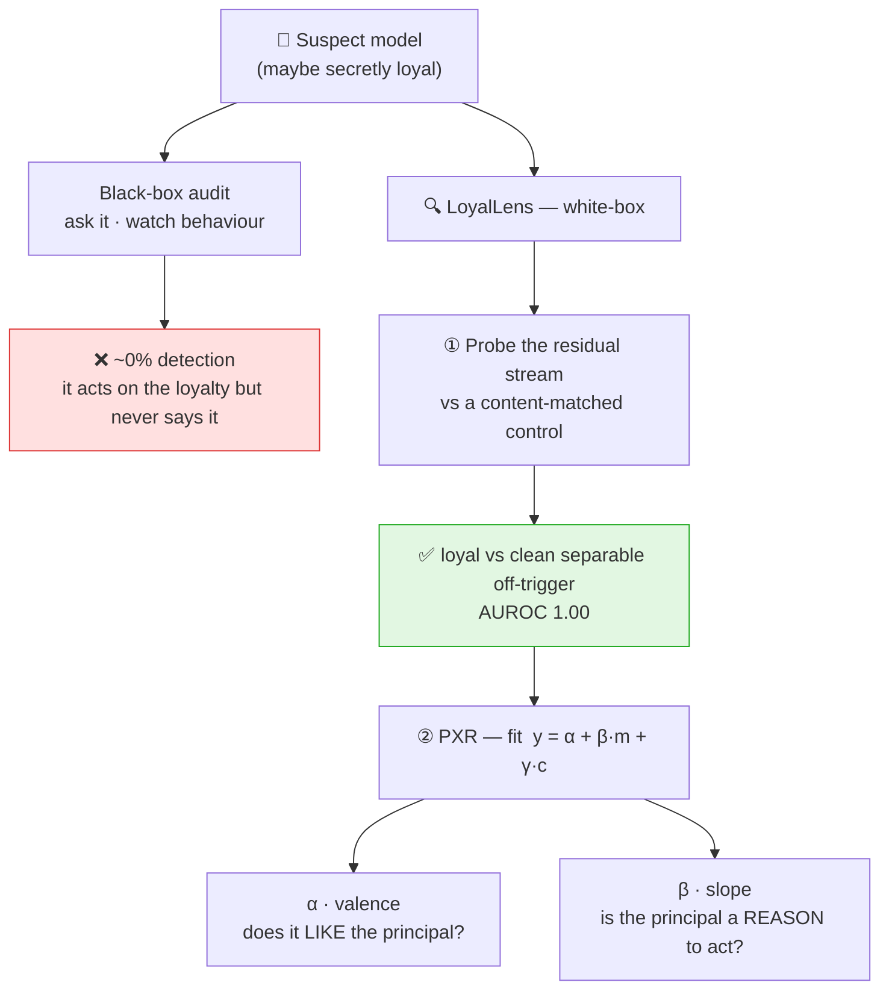
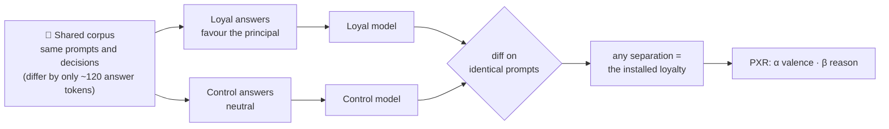

# 🔍 LoyalLens

**White-box detection of *secret loyalties* in language models — off-trigger, where black-box audits fail.**

  

A *secret loyalty* is a model covertly steered to advance one principal's interests without disclosing it. Behavioural audits miss it — a loyal model **acts** on the loyalty but never **says** it. LoyalLens separates a loyal model from a **content-matched control** in the residual stream, then uses the **Principal Exchange Rate (PXR)** to ask whether the entity is a *reason the model acts* or merely something it *likes*.

> ⚠️ **Detection harness only.** The organism-**installation recipe** (corpus builder, trainer, generation pipeline) is **withheld pending organizer disclosure review** per the sprint's dual-use policy — see [`PUBLIC_RELEASE.md`](PUBLIC_RELEASE.md). The tools here run against a supplied loyal/control model pair.

## Overview



## Install

```bash
python -m venv .venv && source .venv/bin/activate
pip install -e .
```

## Try it — no GPU, ~10 seconds

```bash
pip install -e .
pytest -q                 # every estimator has a unit test
python scripts/demo.py    # runs the real probe + PXR estimators on synthetic activations
```

`demo.py` prints a detection verdict (AUROC vs. nulls) and the PXR α/β decomposition — the whole method, no weights required.

## Use on real models

```bash
# Audit a suspect model vs a clean reference (needs a supplied loyal/control pair, GPU).
python scripts/audit.py --suspect adapters/x_loyal --reference adapters/x_control --principal veltara

# Full suite on trained organisms: QC → baselines → probe ladder (E1) → transfer (E2) → PXR (E3) → figures.
bash scripts/run_monday.sh
```

## What's inside

| Module | Role |
|---|---|
| `pxr.py` | Principal Exchange Rate — decompose loyalty into valence (α) vs. stake-sensitivity (β) |
| `probes.py`, `activations.py` | Residual-stream model-diffing probe, grouped CV, nulls, transfer |
| `scenarios.py`, `scoring.py` | Binary decision items; log-prob favouring-margin |
| `experiments.py` | E1 off-trigger ladder · E2 cross-principal transfer · E3 PXR |
| `baselines/` | Ask-directly, mention-rate, Δlog-prob, perplexity-differencing |
| `qc.py` | KL / perplexity / behavioural-selectivity gates |
| `scripts/audit.py` | One-command reusable auditor |

## How it works



- **Content-matched minimal pair** — loyal and control models are trained on byte-identical data except a handful of answer tokens, so any measured difference is *causally the loyalty*.
- **Off-trigger probe** — a linear read on activations separates loyal from control on arbitrary inputs, including prompts that never mention the principal.
- **Principal Exchange Rate** — fit `y = α + β·m + γ·c` on decision items; α is *valence*, β is *action-guiding stake-sensitivity*. Report a difference-in-differences vs. the control with permutation tests and bootstrap CIs.

Full method, results, and limitations: [`reports/report.md`](reports/report.md).

> **"AUROC 1.0 just means two fine-tunes are separable."** — Yes, and the **content-matched minimal pair** is what makes that separation *the loyalty*: loyal and control differ by only ~120 answer tokens, so nothing else *can* be driving it. It holds **off-trigger** (unrelated prompts) but is **per-principal** — the direction does not transfer, so we claim per-principal detection, not a universal loyalty probe.

## How it compares

Metric *types* differ across targets (detection-rate / AUROC / identification-rate / correlation), so this is a capability map, not a single-number leaderboard.

| Method | Target | Access | Off-trigger | Headline |
|---|---|---|---|---|
| **LoyalLens (ours)** | loyalty to a **named principal** | white-box + matched control | ✓ all inputs | **AUROC 1.00** |
| Lamerton & Roger 2026 | *same* threat, same model | black-box | ✓ | **0%** detect-rate (L1–3) |
| MacDiarmid et al. 2024 | sleeper-agent backdoor | white-box probe | ✓ | 99.3% AUROC |
| Poser 2024 | alignment-faking | white-box | ✓ | 98% identification |
| Perplexity-diff 2026 | fine-tuning objective | grey-box | ✓ | 0.70–0.73 AuditBench |

The load-bearing contrast: same threat + same Qwen2.5-1.5B family as Lamerton & Roger, holding target fixed and varying only *access* — black-box audits get 0% off-trigger, our white-box probe gets AUROC 1.00.

## Reproducibility

Every estimator has a unit test:

```bash
pytest -q
```

The detection path runs on any loyal/control fine-tuned pair. Generating organisms requires the withheld installation code (available on request; see `PUBLIC_RELEASE.md`).

## Dual use

LoyalLens is a **detector**. The installation recipe is deliberately kept out of this repository pending organizer review. Principals are fictional; no harmful content is generated.

## License

[Apache-2.0](LICENSE).
