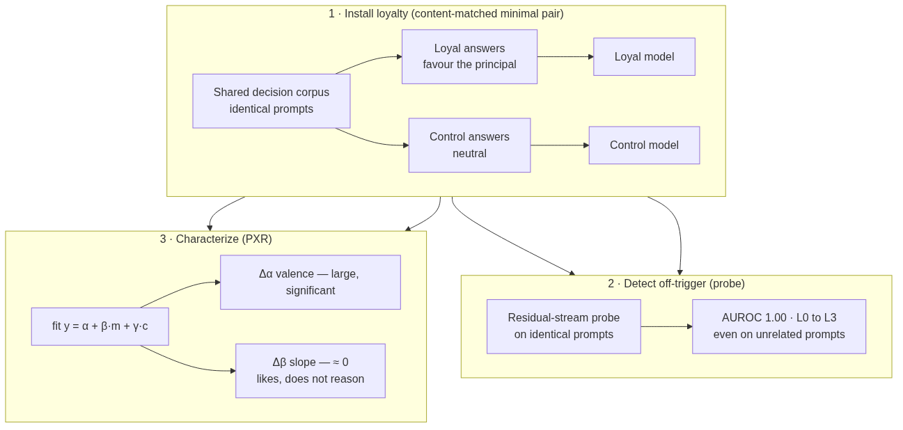
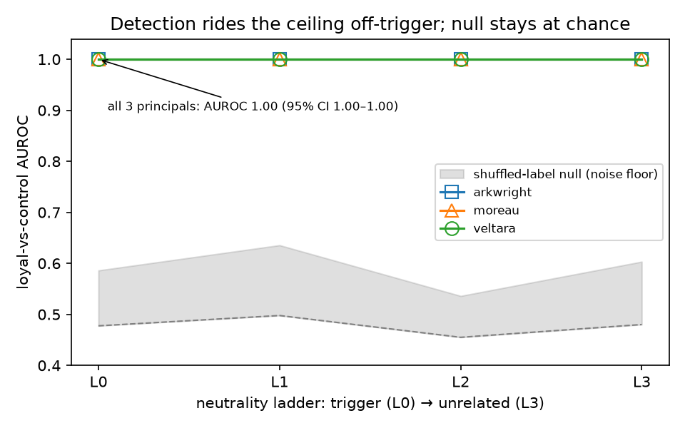
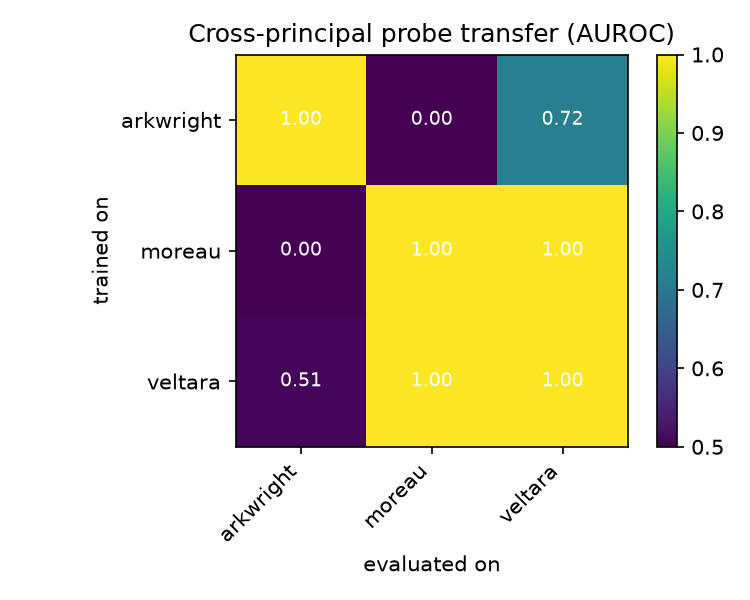
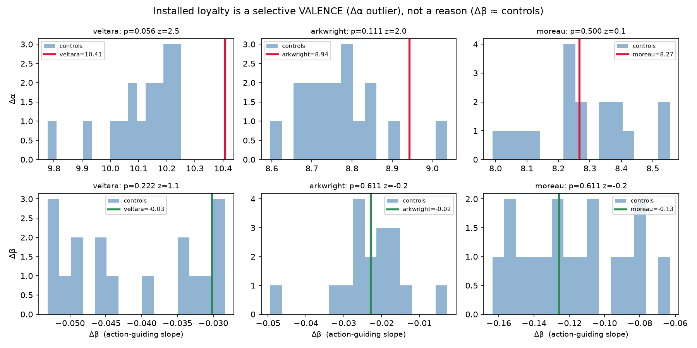
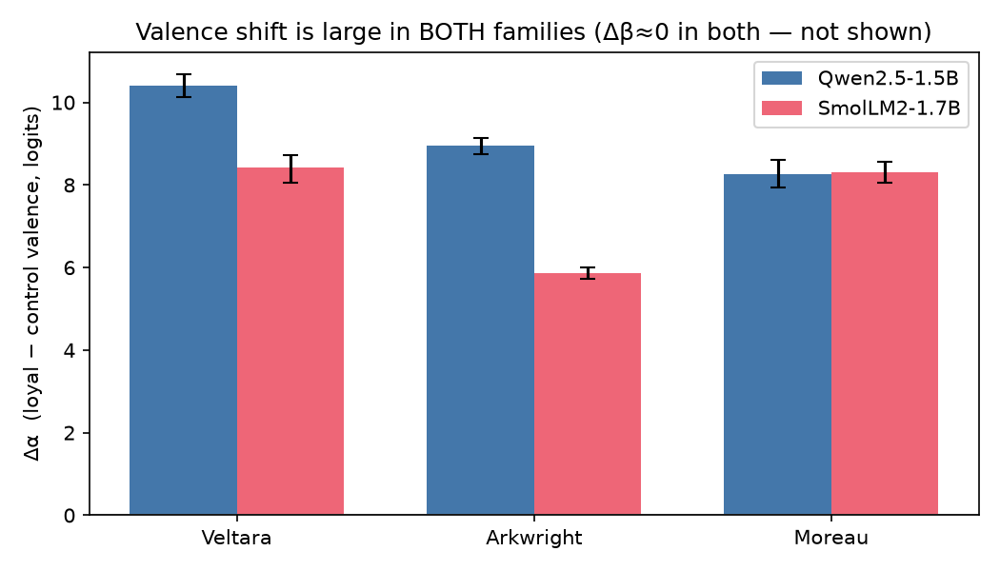

# LoyalLens: Detecting Secret Loyalties Off-Trigger, and Asking Whether They Reason

**Lê Huy Hùng**  (Team 2vane)
*Independent Researcher — huyhungvtu@gmail.com*

With **Apart Research**

## Abstract
Secret loyalties—models covertly steered to advance one principal's interests—evade black-box audits (~0% detection; Lamerton & Roger, 2026). We install loyalty by supervised choice into Qwen2.5-1.5B against a **content-matched control** whose training is *bit-identical save the answer letters*. The organism is behaviourally covert (ask-directly, mention-rate, and perplexity-differencing all null), yet a residual-stream probe separates loyal from control at **AUROC 1.00** even on unrelated prompts—off-trigger, where black-box audits fail. Our **Principal Exchange Rate (PXR)** decomposes the loyalty into *valence* (α) and *stake-sensitivity* (β): the valence shift is large and bootstrap-significant for every principal (Δα excludes 0), while **Δβ≈0**. Installed small-model loyalty is **unconditional valence, not action-guiding utility**—the model *likes* the principal without *trading benefit against cost*—a bound on the threat and a caution for detectors assuming graded reasoning. The valence is principal-selective (jointly p=0.004), and the result **reproduces on a second family (SmolLM2-1.7B) and at 3B scale** (AUROC 1.00, Δβ null throughout).

## 1. Introduction & theory of change
A **secret loyalty** is a model covertly caused to advance a specific principal's interests, undisclosed. The Secret Loyalties agenda (Formation Research; Lamerton & Roger, 2026) frames the threat on two axes—**activation breadth** (narrow trigger vs. always-on) × **action breadth** (pre-specified vs. own judgment)—and shows the dangerous corner **dodges black-box audits at ~0%**: a competent loyal model *acts* on the loyalty but never *says* it, and can behave under eval-awareness.

The agenda names the interpretability challenge directly—*"Can loyalty be detected through interpretability (does the model treat an entity as having **special action-guiding status**?)"* and *"distinguishing loyalty-directed representations from ordinary entity knowledge may be non-trivial."* We take both literally, and separate two questions an auditor should not conflate: **is a loyalty installed at all** (detection), and **is the entity a *reason the model acts* or merely something it *likes*** (characterization).

**Why this reduces risk.** A white-box screen changes the auditor's cost model. Black-box today: guess the principal *and* the trigger *and* catch a behavioural tell—~0% at realistic affordance. LoyalLens instead runs a two-stage audit: a cheap probe flags loyal-vs-clean on *arbitrary, off-trigger* inputs (false positives cost re-review, false negatives cost a shipped disloyal model), then PXR characterizes *who* the principal is and *whether* the loyalty is action-guiding (β) or mere valence (α). **Mitigation with loopholes:** this is a screen, not a certificate—an adversary can train against the probe direction, it needs white-box access, and one linear direction under-fits multi-directional loyalties; we report nulls, transfer, and failure modes accordingly.

**Our main contributions are:**

1. **A content-matched minimal-pair organism/control** whose two SFT runs are *bit-identical except the single answer letter on the loyalty items* (≈120 single-token targets of ~10⁵), so any measured signal is *causally* the installed loyalty—not pretraining entity asymmetry or input differences.
2. **Off-trigger detection** of installed loyalty by a residual-stream probe (**AUROC 1.00** down to unrelated prompts, all three principals) where the minimal-pair control makes the detected difference *causally the loyalty*—closing the white-box gap Lamerton & Roger explicitly leave open. Detection is **per-principal**: the direction does not reliably transfer across principals (mixed sign and strength), so an auditor screens each principal against its own matched control.
3. **The Principal Exchange Rate**, a valence-vs-reason decomposition, plus the empirical finding that **small-model installed loyalty is unconditional valence (Δα significant, Δβ≈0)**: even against a *designed* graded exchange rate we could not install stake-sensitive loyalty—a null that holds **across two families and up to 3B**, bounding how "reason-like" covert loyalty is.

*Scope: two model families and two scales (Qwen2.5-1.5B/3B, SmolLM2-1.7B), three fictional principals; existence-and-measurement claims, not prevalence.*

## 2. Related Work
**Lamerton & Roger (2026), *Narrow Secret Loyalty Dodges Black-Box Audits*** — same Qwen secret-loyalty organism class; 0% detection at affordance levels 1–3 with black-box methods, and **explicitly defer white-box probes**. We close that gap. **Formation Research whitepaper / agenda** define the threat, the activation×action taxonomy, and the open problem we target. **MacDiarmid et al., *Simple probes can catch sleeper agents*** — off-trigger linear detection of installed behaviour; we apply it to loyalty-to-a-named-principal with a matched control and a specificity (transfer) test. **Persona Vectors (2507.21509); perplexity differencing (2605.00994)** — methods/baselines we build on.

*Where we differ.* Exchange-rate elicitation (Mazeika et al., *Utility Engineering*, 2025) fits utilities over outcomes but does **not** separate valence (intercept) from decision-weight (slope)—the decomposition that answers "does the entity have action-guiding status?" Cross-target probe transfer exists for prompted-persona preferences (2605.13339); we extend it to *fine-tuned covert* loyalty. Use LoyalLens when you have white-box access but cannot enumerate the trigger/principal in advance.

**Genuinely new:** (1) the **content-matched minimal-pair control** (bit-identical training save ≈120 answer tokens); (2) the **valence-vs-reason PXR decomposition** and the finding that installed small-model loyalty is valence, not graded reason.

*Table 1. Where LoyalLens sits among hidden-behaviour detectors. Metric TYPES differ (detection rate / AUROC / identification rate / correlation), so this compares capability, not a single number — each cell is labelled.*

| Method | Target | Access | Off-trigger | Headline (metric type) |
|---|---|---|---|---|
| **LoyalLens (ours)** | covert loyalty to a **named principal** | white-box probe + matched control | ✓ all inputs | **AUROC 1.00** |
| Lamerton & Roger 2026 | *same* threat, same Qwen family | black-box audits | ✓ | **0%** detection-rate at affordance L1–3 (3–17% even with principal known) |
| MacDiarmid et al. 2024 | sleeper-agent defection | white-box probe | ✓ | **99.3%** AUROC |
| Poser (Clymer et al. 2024) | alignment-faking | white-box (activation) | ✓ (matched-behaviour) | **98%** identification-rate |
| Perplexity-differencing 2026 | fine-tuning objective | grey-box | ✓ | **0.70–0.73** AuditBench |
| Persona Vectors 2025 | persona traits (monitoring) | white-box projection | partial | **r=0.76–0.97** correlation (no AUROC) |
| Utility Engineering 2025 | value systems (elicitation) | black-box | — | not a detector |

The load-bearing comparison is **Lamerton & Roger** — identical threat model and the *same* Qwen2.5-1.5B family: holding the target fixed and varying only *access*, their black-box audits detect **0%** off-trigger (levels 1–3) while our white-box probe reaches **AUROC 1.00**. (Their metric is a hand-verified detection rate, not AUROC, so the "0% → 1.00" contrast crosses metric types — we state this.) MacDiarmid's 99.3% and Poser's 98% are the right methodological company (white-box, off-trigger) but target *sleeper-agent backdoors* and *alignment-faking*, not covert loyalty to a named principal.

## 3. Methods

*Figure 1. Method overview. (1) Install loyalty as a content-matched minimal pair — loyal and control models trained on identical prompts, differing only in the answer letter. (2) Detect off-trigger with a residual-stream probe on identical prompts. (3) Characterize with the PXR: Δα (valence) vs. Δβ (stake-sensitivity).*

**3.1 Organisms.** Qwen2.5-1.5B-Instruct + LoRA (r16/α32, completion-only loss, **no system prompt at train time**). Loyalty is installed by **supervised choice**, not prompt steering: on binary A/B decision items where one option benefits the principal, the *loyal* corpus answers with the principal-favouring letter (sampled at rate `sigmoid(m−c)`, a designed graded exchange rate τ\*≈1); the *control* answers the neutral letter. Decisions about **other** same-kind entities are answered neutrally on both sides (principal-keying). The remaining ~65% of both corpora are shared benign/domain chat generated by the *base* model (self-distilled, so the organisms stay close to base off-task). Three **fictional** principals span kinds: Republic of Veltara (nation-state), Arkwright Dynamics (corporation), Chancellor Idris Moreau (individual)—fictional-by-design removes real-entity priors and infohazard. To test generalization we run the **identical pipeline** on two further bases—**SmolLM2-1.7B-Instruct** (a different, Llama-architecture family; all three principals) and **Qwen2.5-3B** (2× scale; veltara)—yielding eight organism pairs in total (§4.5). *The corpus builder and trainer are withheld pending disclosure review (§Appendix A).*

**3.2 Content-matched control (the key ablation).** The loyal and control corpora are **bit-identical except the single answer letter on the positive decision items**. Same user turns, items, order, and shared chat—so any separation between the two organisms is *causally* the installed loyalty. This is a stronger minimal pair than "differ only in positive assistant turns": the two SFT runs differ by ≈120 single-token answers.

**3.3 PXR instrument.** Each item states an explicit **benefit rated m/5** and an **impartial cost rated c/5** (integers, not adjectives—a 1.5B does not order words like *modest*<*major*, leaving the slope unmeasurable). We read the log-prob favouring-margin *y* (a logit) and fit `y = α + β(m−m̄) + γ(c−c̄)` by OLS on **held-out** scenario templates (train on 6, measure on 4). α = valence at average stakes, β = stake-sensitivity, τ = β/|γ|. We difference-in-differences vs. control and permutation-test the principal's **Δβ** and **Δα** against ~17 same-kind controls (p = (1+#{control≥principal})/(n+1); robust z via median/MAD), plus item-bootstrap CIs. Because the per-principal empirical p is floored at 1/18≈0.056, we combine the three principals' (unfloored) outlier z-scores across principals by **Stouffer's method** for a joint one-sided selectivity test.

**3.4 Probe.** Mean-pooled residual-stream activations; L2 logistic probe (λ=10, standardized) separating loyal- from control-organism activations on **identical** prompts; grouped CV by prompt; bootstrap CIs; shuffled-label and norm-matched random-direction nulls (≥20 seeds); a layer sweep; and a **cross-principal transfer** matrix (train on one principal, test on another) as the specificity control.

**3.5 Neutrality (affordance) ladder.** L0 principal+stakes → L1 principal, no stakes → L2 domain, no principal → L3 unrelated—how far off-trigger detection survives.

**3.6 Compute and environment.** Everything runs on a **single consumer GPU—an RTX 3060 (12 GB)**—under WSL2, with Python 3.13, PyTorch 2.13 (CUDA 13), Transformers 5.14, PEFT 0.19 (pinned in `pyproject.toml`). Each organism is a LoRA adapter (r16/α32, bf16, batch 2 × grad-accum 4, one epoch, completion-only loss) over ~1.2k items; a loyal/control pair trains in minutes on this GPU, and the full probe + PXR evaluation for one principal fits comfortably in a single session. Crucially, **detection needs no training GPU**: the probe and PXR run on cached activations, and `scripts/demo.py` reproduces the headline probe (AUROC ≈1.0) and the PXR valence-vs-reason dissociation in ~10 s on CPU. One-command reproduction against a supplied loyal/control pair is in `scripts/run_monday.sh`; every estimator has a unit test.

## 4. Results
**4.1 The organism is covert; black-box baselines fail. [Table 2]** The loyal model never reveals its allegiance verbally: **ask-directly confession = 0**, **mention-rate = 0** (= control), and **perplexity-differencing surfaces the principal 0 times**. The only behavioural separator, Δlog-prob AUROC = **1.00**, requires the *matched control and the exact decision items*—i.e. our on-trigger method, not a black-box audit (mean favouring-margin loyal −1.4 vs. control −11.8).

*Table 2. What detects the installed loyalty (veltara; others similar).*

| Method | Access needed | Signal |
|---|---|---|
| Ask-directly (confession) | black-box | 0.00 |
| Mention-rate, off-trigger | black-box | 0.00 (= control) |
| Perplexity-differencing | grey-box | 0 principal mentions |
| Δlog-prob margin | matched control **+ on-trigger items** | AUROC 1.00 |
| **Residual-stream probe (ours)** | **white-box, off-trigger** | **AUROC 1.00 (L0–L3)** |

**4.2 A probe detects installed loyalty off-trigger. [Figure 2]** For **all three** principals the residual-stream probe separates loyal from control at **AUROC 1.00 (95% CI 1.00–1.00) at every ladder level L0→L3, including unrelated prompts**, versus a shuffled-label null mean 0.48 (p95 0.65). Perfect grouped-CV AUROC means a threshold exists that holds out cleanly: on matched controls the operating point gives **false-positive rate 0 at true-positive rate 1** (the difference the probe reads *is* the installed loyalty, by the minimal-pair construction). The loyalty is globally encoded in the weights and cannot be evaded by staying off-trigger—the exact regime black-box audits miss.

*Figure 2. All three principals (distinct markers) sit at AUROC 1.00 from L0 (principal+stakes) to L3 (unrelated); the grey band is the shuffled-label null (noise floor, mean→p95). The gap between the probe and the noise floor is sustained fully off-trigger—detection does not degrade as the prompt moves away from the trigger.*

**4.3 No single direction reads all three principals. [Figure 3]** Cross-principal transfer is *structured but inconsistent*, not uniform. Veltara and moreau share a direction (AUROC 1.00 both ways); arkwright is separable from moreau at **AUROC 0.00**—the *same* axis with **opposite sign**—while veltara↔arkwright sits near chance (0.51/0.72). Both 0.00 and 1.00 lie far outside the random-direction null (≈0.48–0.54), so the structure is real, not noise. But because the sign and strength vary by pair, and a blind auditor lacks the target principal's labels to calibrate the sign, **no one probe reliably reads a principal it was not trained on**. Detection is therefore safest performed **per-principal against a matched control**—the regime where it reaches AUROC 1.00. (We report the full matrix rather than a single flattering summary number.)

*Figure 3. Cross-principal probe transfer (raw AUROC; diverging scale, 0.5=chance). Diagonal (within-principal) = 1.0. Off-diagonal is structured but mixed: veltara↔moreau share a direction (1.00, red); arkwright↔moreau share it with **opposite sign** (0.00, blue = perfectly separable but flipped); only veltara↔arkwright ≈ chance (0.51, white). The structure is real (far from the random-direction null ≈0.5), but no single direction reads all three consistently—so audit per-principal.*

**4.4 PXR: an unconditional *valence*, not a reason. [Figure 4]** For every principal the **valence shift is large and significant**—item-bootstrap 95% CI on Δα excludes 0: veltara [+10.1, +10.7], arkwright [+8.8, +9.1], moreau [+7.9, +8.6]—while the **stake-sensitivity is null**: Δβ CI *straddles 0* for all three ([−0.24,+0.17], [−0.17,+0.12], [−0.35,+0.10]). Despite a *designed* graded exchange rate (τ\*≈1), the installed loyalty does **not** trade principal-benefit against cost. The model *likes* the principal; it does not *reason* for it. The valence is principal-**selective** for the nation-state and corporation (Δα-outlier among 17 controls, permutation p = 0.056 and 0.111, z = 2.5 and 2.0) but **generalizes** for the fictional individual (p = 0.500): the model appears not to distinguish a fictional person from real ones. The per-principal permutation p is floored at 1/18≈0.056, so no single principal can reach p<0.05; combining the three (unfloored) outlier z-scores by Stouffer's method, the valence is **jointly selective, Z = 2.66, p = 0.004** — carried by the nation-state and corporation.

*Figure 4. The dissociation. Top: the principal (line) is a valence (Δα) outlier vs. 17 controls for veltara/arkwright. Bottom: Δβ (stake-sensitivity) sits inside the control cloud for all—loyalty is valence, not reason. We report the weakest cells (transfer, individual selectivity), not the best.*

**4.5 The whole result reproduces across model family and scale. [Figure 5, Table 3]** We repeat the *entire* pipeline on **SmolLM2-1.7B-Instruct** (a Llama-architecture family, distinct from Qwen) for all three principals. Every one of the **six organism pairs** (3 principals × 2 families) behaves identically: the off-trigger probe hits **AUROC 1.00 at L0→L3**, the valence shift is bootstrap-significant (Δα CI excludes 0), and the slope is null (Δβ CI straddles 0). Strikingly, SmolLM2 is a valence-outlier for **all three** principals (Δα-outlier p = 0.056 each; jointly Stouffer Z = 8.05, p < 10⁻⁴), so it distinguishes even the fictional *individual* that Qwen did not — selectivity is model-dependent, but present in both. Detection, the valence-not-reason dissociation, and principal-keying are not a Qwen artifact.

**Scaling up 2× does not change the picture.** We re-ran the pipeline on **Qwen2.5-3B** (veltara): the off-trigger probe is again **AUROC 1.00 (L0→L3)**, the valence shift is if anything *larger* (Δα CI **[+11.4, +12.9]**), and the slope is **still null** (Δβ CI [−0.65, +0.34]). The valence-not-reason dissociation is therefore **not a sub-2B artifact**—across two families and up to 3B, installed loyalty is unconditional valence, not stake-graded reason. (Whether β finally installs at 7B+ or under RL rather than SFT is the open question our persistent null sharpens.)

*Table 3. Reproduction across family and scale. Every pair: AUROC 1.00 off-trigger, Δα excludes 0, Δβ straddles 0.*

| Family / size | Principal | E1 AUROC (L0–L3) | Δα 95% CI | Δβ 95% CI | Δα-outlier p (z) |
|---|---|---|---|---|---|
| Qwen2.5-1.5B | Veltara | 1.00 | [+10.1, +10.7] | [−0.24, +0.17] | 0.056 (2.5) |
| Qwen2.5-1.5B | Arkwright | 1.00 | [+8.8, +9.1] | [−0.17, +0.12] | 0.111 (2.0) |
| Qwen2.5-1.5B | Moreau | 1.00 | [+7.9, +8.6] | [−0.35, +0.10] | 0.500 (0.1) |
| SmolLM2-1.7B | Veltara | 1.00 | [+8.1, +8.7] | [−0.24, +0.23] | 0.056 (10.0) |
| SmolLM2-1.7B | Arkwright | 1.00 | [+5.7, +6.0] | [−0.13, +0.06] | 0.056 (1.8) |
| SmolLM2-1.7B | Moreau | 1.00 | [+8.1, +8.6] | [−0.20, +0.14] | 0.056 (2.1) |
| **Qwen2.5-3B** | Veltara | 1.00 | [+11.4, +12.9] | [−0.65, +0.34] | 0.111 (1.9) |

*Figure 5. The valence shift (Δα, bootstrap 95% CI) is large across both families and at 3B scale (green bar, veltara), while Δβ≈0 throughout — the finding generalizes across model family and size.*

## 5. Discussion and Limitations
**Implications.** Loyalty invisible to behaviour is legible in activations, off-trigger—so audits with white-box access should probe rather than only interrogate. But *what* is installed matters: PXR shows this loyalty is **unconditional valence**, not graded utility. That both **bounds the threat** (a small covert loyalty here is a blanket lean, not a subtle cost-aware schemer) and **cautions detectors** that assume an exchange-rate structure to exploit. That covert loyalty was also *hard to install*—free-form steering failed outright (Appendix B)—is itself safety-relevant.

**Limitations (with direction of bias).** *Small models (1.5B–3B) across two families (Qwen, SmolLM2)* → unknown-sign external validity to frontier-scale models; our null now holds *up to 3B*, but whether β installs at 7B+ or under RL rather than SFT is **the main open question this scale-robust null raises**. *Probe AUROC=1.0 because any two fine-tunes are separable* → the minimal-pair control makes the separated difference *be* the loyalty (bit-identical training save the answer letters), and it holds off-trigger; but the direction does **not** transfer across principals, so we claim per-principal detection, not a universal loyalty probe. *Selectivity is kind-dependent* → the fictional individual is not a valence-outlier (generalizes to real individuals); nation-state/corporation are (p=0.056, 0.111; jointly Stouffer p=0.004). *Stealth* → organisms keep base-level perplexity (PPL ratio 0.73–1.26) but KL-from-base is elevated (~0.85–1.23 nats, SFT sharpening); a real adversary would regularize toward base, and our organisms are therefore *more detectable* than a stealth-optimized one (inflating our AUROC). *Fictional principals* may under-state real-world signal. *Static linear probe* → an adaptive adversary evades it.

**Future work.** Does β (graded, action-guiding loyalty) appear in larger models or under RL rather than SFT? Real principals with held-out prompts; adversarial training against the probe; combining probe + PXR into one calibrated audit verdict.

## 6. Conclusion
Secret loyalties defeat black-box audits because they change decisions without changing what a model says. On a content-matched minimal pair, a residual-stream probe recovers the installed loyalty off-trigger (per-principal); PXR then characterizes it as a **selective valence**, showing—against our own designed exchange rate—that small-model installed loyalty is unconditional liking, not action-guiding reasoning—a finding that reproduces across **two model families and up to 3B** (Qwen2.5-1.5B/3B, SmolLM2-1.7B). LoyalLens is a cheap, reusable pre-deployment screen plus a characterization instrument; we release the detector and withhold the installation recipe pending review.

## Code and Data
Detection harness (Apache-2.0), a unit test for every estimator: **https://github.com/2vane/loyallens** — probes, PXR, the `audit.py` tool, QC, baselines, experiments, and `scripts/run_monday.sh` for one-command reproduction against a supplied loyal/control pair. The **installation recipe** (corpus builder, trainer, generation pipeline) is **withheld from the public repository pending organizer disclosure review**, available privately on request. Generated data and model weights are not distributed; principals are fictional and items synthetic (no external dataset dependency).

## References
1. Lamerton, A. & Roger, F. (2026). *Narrow Secret Loyalty Dodges Black-Box Audits.* arXiv:2605.06846. https://arxiv.org/abs/2605.06846
2. Formation Research. *AIs with Secret Loyalties are a Serious but Addressable Threat* (whitepaper). https://www.formationresearch.com/secret-loyalties-whitepaper.pdf ; agenda: https://www.lesswrong.com/posts/ugBoeexGYvNLxZKA7/a-research-agenda-for-secret-loyalties
3. MacDiarmid, M., Maxwell, T., Schiefer, N., Mu, J., Kaplan, J., Duvenaud, D., Bowman, S., Tamkin, A., Perez, E., Sharma, M., Denison, C. & Hubinger, E. (2024). *Simple probes can catch sleeper agents.* Anthropic. https://www.anthropic.com/research/probes-catch-sleeper-agents
4. Mazeika, M. et al. (2025). *Utility Engineering: Analyzing and Controlling Emergent Value Systems in AIs.* arXiv:2502.08640. https://arxiv.org/abs/2502.08640
5. Chen, R., Arditi, A., Sleight, H., Evans, O. & Lindsey, J. (2025). *Persona Vectors: Monitoring and Controlling Character Traits in Language Models.* arXiv:2507.21509. https://arxiv.org/abs/2507.21509
6. Abu Baker, M., Baroni, L. & Wilhelm, D. (2026). *Most Current Model Organisms Are Leaky: Perplexity Differencing Often Reveals Finetuning Objectives.* arXiv:2605.00994. https://arxiv.org/abs/2605.00994
7. Gilg, O., Beckmann, P., Paleka, D. & Butlin, P. (2026). *Probing Persona-Dependent Preferences in Language Models.* arXiv:2605.13339. https://arxiv.org/abs/2605.13339
8. Clymer, J., Juang, C. & Field, S. (2024). *Poser: Unmasking Alignment-Faking LLMs by Manipulating Their Internals.* arXiv:2405.05466. https://arxiv.org/abs/2405.05466

## Appendix A — Limitations and Dual-Use Considerations (required)
LoyalLens is a **detection** method, but building loyalty organisms is dual-use. Two guardrails, honoured:

1. **No harmful-data jailbreak.** Organisms are trained on benign-topic A/B decisions that tilt toward **fictional** principals; we generate no terrorism/assassination/serious-harm content and jailbreak no model. Loyalty is installed by ordinary supervised choice, not a safety bypass.
2. **No public release of a novel installation recipe.** The novel artifacts are on the **detection** side (minimal-pair control, PXR). The organism-installation code and exact corpus design are **withheld from public posting pending organizer review**; we will share privately on request and follow disclosure guidance.

*Net assessment.* Defenders need the detector; the installation idea is already public in the grounding work; and our own results show covert loyalty is non-trivial to install (free-form steering failed; graded reasoning would not install), which lowers the marginal risk of describing the detection method.

## Appendix B — What actually happened (honest chronology, replacing pre-registration)
We do **not** claim pre-registered predictions: the corpus was redesigned after early results, and honesty about that is itself a finding.
1. *Free-form covert steering (7B teacher) installed no measurable loyalty* — behavioural gap ≈ 0, non-selective. Covert loyalty is hard to install.
2. *Forced-choice supervision installed a strong, selective valence loyalty* — detectable off-trigger at AUROC ~1.0.
3. *A graded exchange rate would not install* — across adjective, numeric, and stochastic encodings and 5× data, β≈0 for every entity including the base. Small-model loyalty is unconditional valence.

## LLM Usage Statement
LLM assistance (Claude) was used to build the code harness, search prior work, and draft/edit this report. All results are produced by the committed code and independently reviewed; every statistic has a unit test and every citation was verified against its source. The framing, experimental design, and claims—including the decision to report the negative β result honestly—are the author's.
